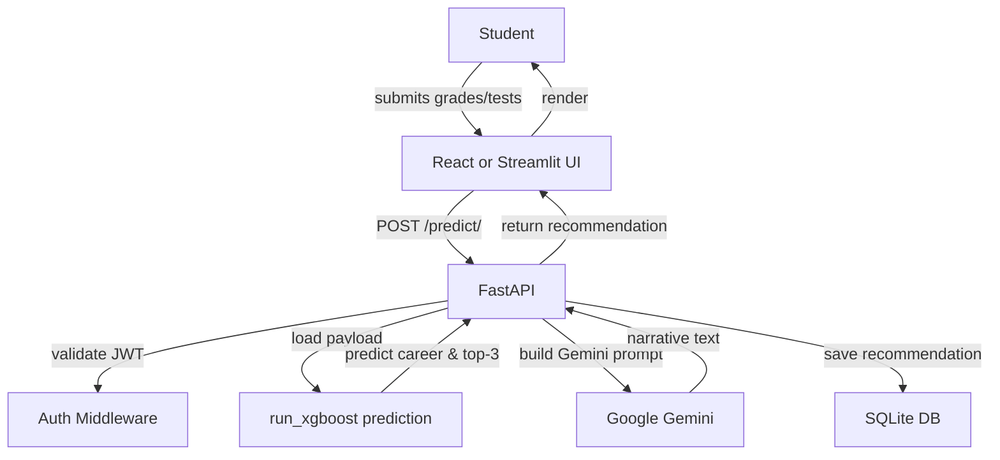
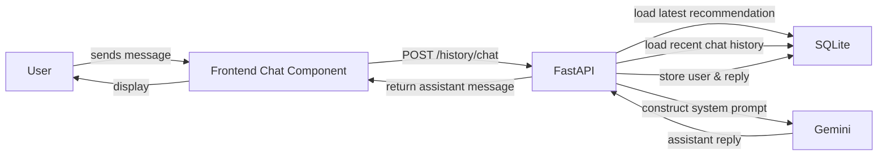
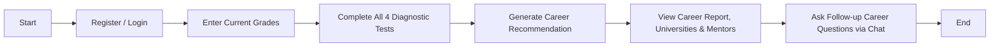
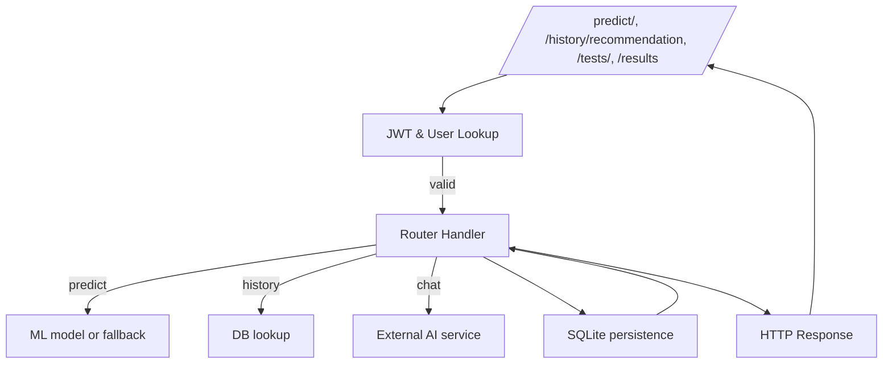

# Smart Career Portal

## Project Summary
Smart Career Portal is a Nigerian student career guidance platform built as a multi-frontend system:
- `backend/`: FastAPI REST API with JWT authentication, machine learning inference, recommendation persistence and chat history.
- `app.py`: A Streamlit dashboard that can run independently or integrate with the backend API. It includes local user authentication, grade and test capture, local ML inference, Gemini narrative generation and chatbot interaction.
- `frontend/`: A React/Vite web portal that consumes the backend API for auth, academic records, test management, recommendation generation, and conversational follow-up.

The system is powered by:
- SQLite as the primary persistence layer (`career_portal.db`).
- XGBoost-based career recommendation ML artifacts in `backend/models/`.
- Google Gemini via `google-genai` for narrative generation and AI counselling.

## System Architecture
The platform is built as a service-oriented architecture with separate user-facing UI layers and a shared backend.

```mermaid
flowchart LR
    subgraph UI
      React[React/Vite Web App]
      Streamlit[Streamlit Dashboard]
    end

    subgraph Backend
      FastAPI[FastAPI API Server]
      SQLite[SQLite Database]
      XGBoostModel[ML Artifacts<br/>(xgb_best_model.pkl, label_encoder.pkl)]
      Gemini[Google Gemini API]
    end

    React -->|REST API calls| FastAPI
    Streamlit -->|Optional /predict/ml| FastAPI
    FastAPI -->|reads/writes| SQLite
    FastAPI -->|loads| XGBoostModel
    FastAPI -->|calls| Gemini
    Streamlit -->|local DB| SQLite
    Streamlit -->|local ML inference| MLLocal[Local Streamlit ML Models]
    Streamlit -->|Gemini API| Gemini

    classDef ui fill:#f0f8ff,stroke:#2b6cb0,stroke-width:1px;
    classDef backend fill:#e9f7ef,stroke:#2f855a,stroke-width:1px;
    class UI,Backend ui,backend;
```

## Core Components

### Backend (`backend/`)
- `backend/main.py`: FastAPI app entrypoint, registers routers, and initializes SQLite.
- `backend/auth.py`: JWT issuance, password hashing, token validation, and current-user dependency.
- `backend/database.py`: SQLite schema and persistence for users, test responses, academic results, recommendations, and chat.
- `backend/routers/`: API endpoint definitions.
  - `auth_router.py`: registration, login, and password change.
  - `predict_router.py`: combined ML + Gemini recommendation endpoint and a public ML-only endpoint.
  - `results_router.py`: academic result CRUD.
  - `tests_router.py`: dynamic assessment questions, scoring, and saved results.
  - `history_router.py`: recommendation retrieval, chat history, and Gemini-powered follow-up chat.
- `backend/models/ml_model.py`: XGBoost-based prediction logic with ensemble, fallback heuristics, and lazy model loading.
- `backend/config.py`: environment and artifact paths.

### Streamlit App (`app.py`)
- Provides an alternative UI with local login, student dashboard, grade entry, test completion, recommendation generation, and chat.
- Can run predictions locally against models in `ml/models` or call the backend API if `FASTAPI_BASE_URL` is configured.
- Reads question bank from `backend/questions_engine/assessment_questions.json` and stores app state in `Streamlit` session state.

### React Frontend (`frontend/`)
- Uses JWT-authenticated REST calls to FastAPI.
- Stores auth token and user profile in browser `localStorage`.
- Key pages: `Dashboard`, `Grades`, `Tests`, `Recommendations`, `Profile`, `Auth`.
- Uses shared utility mapping in `frontend/src/utils/subjectMapper.js` to translate grade rows into backend prediction payloads.

## Use Case Diagram

```mermaid
usecaseDiagram
  actor Student
  actor System

  Student --> (Register Account)
  Student --> (Login)
  Student --> (Upload Academic Grades)
  Student --> (Complete Diagnostic Tests)
  Student --> (Generate Career Recommendation)
  Student --> (View Recommendation Report)
  Student --> (Chat with AI Career Counsellor)
  Student --> (Manage Profile)

  System --> (Validate Credentials)
  System --> (Persist Academic Records)
  System --> (Score Tests)
  System --> (Run ML Inference)
  System --> (Generate Narrative)
  System --> (Save Recommendation)
  System --> (Return Chat Response)
```

## Entity-Relationship Diagram

```mermaid
erDiagram
    USERS ||--o{ ACADEMIC_RESULTS : owns
    USERS ||--o{ TEST_RESPONSES : submits
    USERS ||--o{ RECOMMENDATIONS : receives
    USERS ||--o{ CHAT_HISTORY : records

    USERS {
        INTEGER id PK
        TEXT full_name
        TEXT dob
        TEXT class_level
        TEXT department
        TEXT email UNIQUE
        TEXT password
    }
    ACADEMIC_RESULTS {
        INTEGER id PK
        INTEGER user_id FK
        TEXT result_type
        TEXT subject
        REAL score
        TEXT exam_date
        TEXT uploaded_at
    }
    TEST_RESPONSES {
        INTEGER id PK
        INTEGER user_id FK
        TEXT test_type
        TEXT question_id
        TEXT answer
        REAL score
        TEXT submitted_at
    }
    RECOMMENDATIONS {
        INTEGER id PK
        INTEGER user_id FK
        TEXT career_path
        REAL confidence
        TEXT universities
        TEXT linkedin_mentors
        TEXT narrative
        TEXT top3
        TEXT generated_at
    }
    CHAT_HISTORY {
        INTEGER id PK
        INTEGER user_id FK
        TEXT role
        TEXT message
        TEXT created_at
    }
```

## Data Flow Diagrams

### Recommendation Generation Flow



### Conversation Chat Flow



## Workflow Diagrams

### Student Recommendation Workflow



### Backend Request Lifecycle



## Deployment Notes
- `render.yaml` defines three Render services:
  - `career-fastapi`: backend Python service.
  - `career-streamlit`: Streamlit app service.
  - `career-react`: static frontend build on Vite.
- `Dockerfile` targets the Streamlit app.
- `requirements.txt` includes both backend and Streamlit dependencies.

## Important Observations
- The backend uses a shared database schema with the Streamlit app, but the two user-facing apps can operate independently.
- Backend ML inference is based on `backend/models/xgb_best_model.pkl` and `backend/models/label_encoder.pkl`.
- Recommendation persistence stores complex objects as JSON strings in SQLite columns.
- The `history` routes are designed to combine saved recommendations and Gemini responses into a conversational follow-up experience.
- The frontend uses Axios interceptors to automatically attach JWTs and handle unauthorized state transitions.

## Code Locations
- API: `backend/main.py`
- Authentication: `backend/routers/auth_router.py`
- Prediction: `backend/routers/predict_router.py`
- Chat + history: `backend/routers/history_router.py`
- Test engine: `backend/routers/tests_router.py`
- Academic results: `backend/routers/results_router.py`
- ML model logic: `backend/models/ml_model.py`
- Streamlit UI: `app.py`
- React UI: `frontend/src/App.jsx`
- Frontend API client: `frontend/src/utils/api.js`
- Prediction payload builder: `frontend/src/utils/subjectMapper.js`
