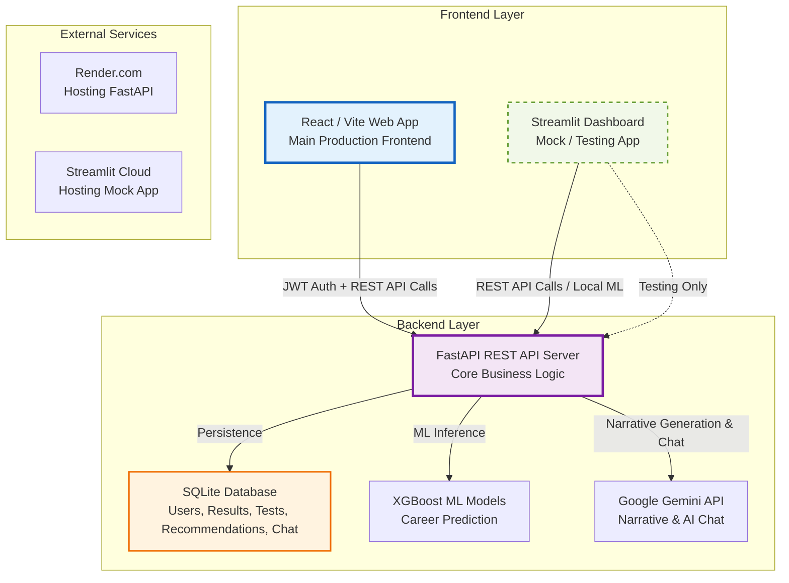
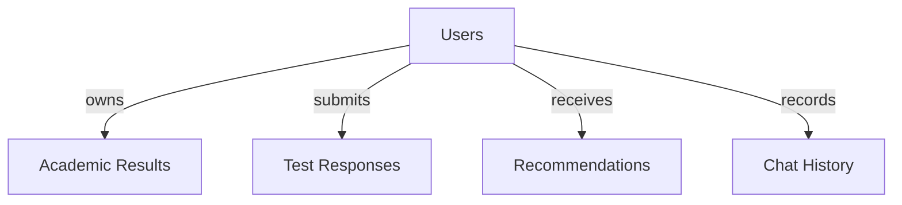
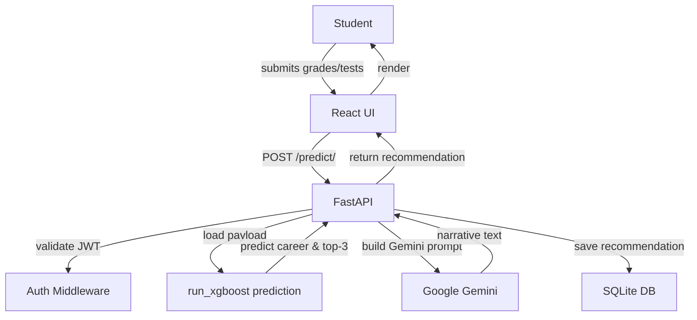
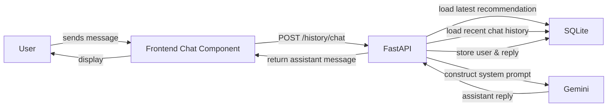
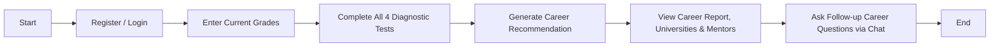
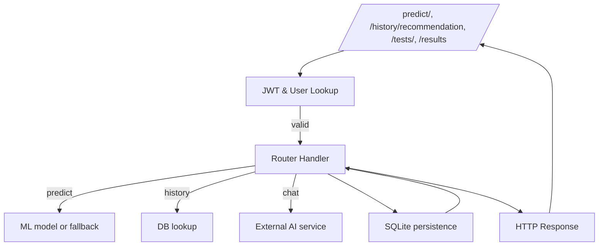
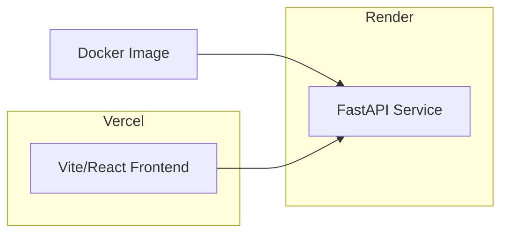

# Smart Career Portal

## Project Summary
Smart Career Portal is a Nigerian student career guidance platform built as a multi-frontend system:
- `backend/`: FastAPI REST API with JWT authentication, machine learning inference, recommendation persistence and chat history.
- `app.py`: A Streamlit dashboard that can run independently or integrate with the backend API. It includes local user authentication, grade and test capture, local ML inference, Gemini narrative generation and chatbot interaction.
- `frontend/`: A React/Vite web portal that consumes the backend API for auth, academic records, test management, recommendation generation, and conversational follow-up.

The system is powered by:
- SQLite as the primary persistence layer (`career_portal.db`).
- XGBoost-based career recommendation ML artifacts in `backend/models/`.
- Google Gemini via `google-genai` for narrative generation and AI counselling.

## System Architecture
The platform is built as a service-oriented architecture with separate user-facing UI layers and a shared backend.

## Core Components

### Backend (`backend/`)
- `backend/main.py`: FastAPI app entrypoint, registers routers, and initializes SQLite.
- `backend/auth.py`: JWT issuance, password hashing, token validation, and current-user dependency.
- `backend/database.py`: SQLite schema and persistence for users, test responses, academic results, recommendations, and chat.
- `backend/routers/`: API endpoint definitions.
  - `auth_router.py`: registration, login, and password change.
  - `predict_router.py`: combined ML + Gemini recommendation endpoint and a public ML-only endpoint.
  - `results_router.py`: academic result CRUD.
  - `tests_router.py`: dynamic assessment questions, scoring, and saved results.
  - `history_router.py`: recommendation retrieval, chat history, and Gemini-powered follow-up chat.
- `backend/models/ml_model.py`: XGBoost-based prediction logic with ensemble, fallback heuristics, and lazy model loading.
- `backend/config.py`: environment and artifact paths.

### Streamlit App (`app.py`)
- Provides an alternative UI with local login, student dashboard, grade entry, test completion, recommendation generation, and chat.
- Can run predictions locally against models in `ml/models` or call the backend API if `FASTAPI_BASE_URL` is configured.
- Reads question bank from `backend/questions_engine/assessment_questions.json` and stores app state in `Streamlit` session state.

### React Frontend (`frontend/`)
- Uses JWT-authenticated REST calls to FastAPI.
- Stores auth token and user profile in browser `localStorage`.
- Key pages: `Dashboard`, `Grades`, `Tests`, `Recommendations`, `Profile`, `Auth`.
- Uses shared utility mapping in `frontend/src/utils/subjectMapper.js` to translate grade rows into backend prediction payloads.

## Use Case Diagram

```mermaid
graph TB
  Student([Student])
  System([System])

  Student --> Register[Register Account]
  Student --> Login[Login]
  Student --> UploadGrades[Upload Academic Grades]
  Student --> CompleteTests[Complete Diagnostic Tests]
  Student --> GenerateRecommendation[Generate Career Recommendation]
  Student --> ViewReport[View Recommendation Report]
  Student --> Chat[Chat with AI Career Counsellor]
  Student --> ManageProfile[Manage Profile]

  System --> Validate[Validate Credentials]
  System --> Persist[Persist Academic Records]
  System --> Score[Score Tests]
  System --> Infer[Run ML Inference]
  System --> Narrative[Generate Narrative]
  System --> Save[Save Recommendation]
  System --> Respond[Return Chat Response]
```

## Entity-Relationship Diagram

## Data Flow Diagrams

### Recommendation Generation Flow

### Conversation Chat Flow

## Workflow Diagrams

### Student Recommendation Workflow

### Backend Request Lifecycle

## Deployment Notes
- `render.yaml` defines three Render services:
  - `career-fastapi`: backend Python service.
  - `career-streamlit`: Streamlit app service.
  - `career-react`: static frontend build on Vite.
- `Dockerfile` targets the Streamlit app.
- `requirements.txt` includes both backend and Streamlit dependencies.

## Important Observations
- The backend uses a shared database schema with the Streamlit app, but the two user-facing apps can operate independently.
- Backend ML inference is based on `backend/models/xgb_best_model.pkl` and `backend/models/label_encoder.pkl`.
- Recommendation persistence stores complex objects as JSON strings in SQLite columns.
- The `history` routes are designed to combine saved recommendations and Gemini responses into a conversational follow-up experience.
- The frontend uses Axios interceptors to automatically attach JWTs and handle unauthorized state transitions.

## Code Locations
- API: `backend/main.py`
- Authentication: `backend/routers/auth_router.py`
- Prediction: `backend/routers/predict_router.py`
- Chat + history: `backend/routers/history_router.py`
- Test engine: `backend/routers/tests_router.py`
- Academic results: `backend/routers/results_router.py`
- ML model logic: `backend/models/ml_model.py`
- Streamlit UI: `app.py`
- React UI: `frontend/src/App.jsx`
- Frontend API client: `frontend/src/utils/api.js`
- Prediction payload builder: `frontend/src/utils/subjectMapper.js`
## Deployment Architecture

### Backend (Render)

- Deployed on Render using `render.yaml` which defines three services:
  - `career-fastapi`: Python FastAPI app container.
  - `career-streamlit`: Streamlit app container.
  - `career-react`: static frontend build on Vite.

### Frontend (Vercel)

- The React/Vite app is built and deployed to Vercel.
- Vercel handles CI/CD on push to `main`, runs `npm install && npm run build` and serves the static files.

### Docker Imaging

- `Dockerfile` builds an image for the Streamlit app.
- Multi‑stage build could be used for FastAPI as well (optional).

## Methodology & Implementation

- **Backend**: FastAPI with JWT authentication, SQLite database, XGBoost ML models, and Google Gemini API integration for narrative generation.
- **Frontend**: React with Vite, Axios for API calls, JWT stored in `localStorage`.
- **Streamlit**: Alternative UI that can load models locally or call the FastAPI backend.
- **Data**: SQLite schema stores users, academic results, test responses, recommendations, and chat history.
- **Machine Learning**: XGBoost model trained on historical student data, using a label encoder for categorical features.
- **AI**: Google Gemini used for narrative generation and conversational counselling.
- **Testing**: Unit tests for routers, model inference, and API endpoints (if present).

## Future Work

- Migrate SQLite to PostgreSQL for better scalability and concurrency handling.
- Add CI pipelines with GitHub Actions for linting, testing, and Docker image publishing.
- Expand AI capabilities with function calling for structured recommendations and richer chat interactions.

## Links To Frontend And Backend Deploments
- [Streamlit](https://smart-career-app.streamlit.app/)
- [Backend-FastAPI](https://smart-career-app-4702.onrender.com)
- [Frontend-UI](https://smart-career-portal.vercel.app/)
